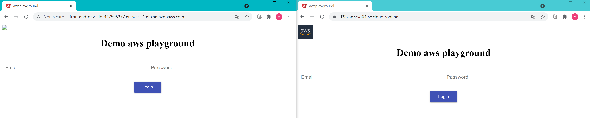

## Platform Requirements

- Ubuntu 18.04
- git 2.17.1
- Docker version 20.10.5, build 55c4c88
- aws cli v2 aws-cli/2.1.26
- Terraform v0.14.6

It's important to set the aws cli since Terraform will use the AWS credentials for the deployment.

## Deployment procedure

The deployment script is able to do
 - initialization of remote state file ( necessary, one shot procedure )
 - infrastructure deployment
 - webapp deployment
 - infrastructure teardown

1. From the root of the repo run

```
bash deploy.sh dev init
```
The output will be the S3 bucket hosting the remote state files. Please keep track of the output
```
## Example
Apply complete! Resources: 2 added, 0 changed, 0 destroyed.

Outputs:
state_bucket = "aws-playground-dev-bb19ba" 
```
since it will be necessary for the subsequent steps. Wait 2 or 3 minutes from the creation of the bucket since it's an eventually consistent process.

2. Now, from the top of the repo run

```
## Example
bash deploy.sh dev infrastructure <state_bucket>
```
The script will trigger the infrastructure code in the following order
 - networking
 - ecs
 - rds
 - webapp
 
The final output will be the Cloudfront distribution endpoint
```
## Example
Apply complete! Resources: 31 added, 0 changed, 0 destroyed.

Outputs:

cloudfront_distribution_domain = "d362b63db76jp1.cloudfront.net"
```
This is what the endpoint will look like compared to the simple load balancer visualization


Please note that only the Cloudfront endpoint is able to render the aws logo.

The procedure can be repeated in case of updates on the infrastructure code. If you want to trigger a new deployment, do some modification on the code folder or infrastructure/webapp  ( just like in a real world scenario! ) then `git add . && git commit -m "foo bar"`. The new commit will be able to trigger the infrastructure/webapp by running the following
```
## Example
bash deploy.sh dev code <state_bucket>
```
When the script exits, you can test the uptime of the deployment by feeding with the following ad-hoc script with the Cloudfront distribution endpoint
```
## Example
bash no_downtime_check.sh d362b63db76jp1.cloudfront.net
```
3. If you are satisfied, then
```
## Example
bash deploy.sh dev teardown <state_bucket>
```
